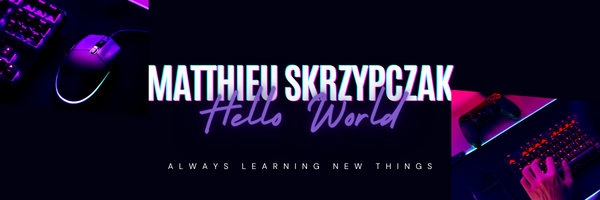

  

  <h1>Hi, I'm Matthieu 👋</h1>

  <h3>Software Developer · Backend · Web · DevOps</h3>

  

    I design, build and deploy reliable software solutions — from backend services
    and databases to infrastructure, automation and user-facing applications.
  

  

    
    
  

---

## About me

I am a software developer based in France, with a background in web and mobile development, application design and software engineering.

Working in a small and versatile team has led me to contribute across the entire software lifecycle: technical design, backend and frontend development, database management, testing, deployment, automation, server administration and security.

I enjoy understanding how every part of a system works together and turning ideas into maintainable, production-ready solutions.

---

## Professional stack

### Backend and application development

  
  
  
  
  

- REST APIs, business applications and backend services
- Software architecture and technical design
- Kotlin Multiplatform and WasmJS applications
- Automated testing, maintenance and continuous improvement
- Code review, refactoring and technical documentation

### Databases

  
  

- Relational data modelling
- Query design and optimisation
- Database integration and administration

### DevOps and infrastructure

  
  
  
  

- CI/CD pipelines and deployment automation
- Docker-based development and production environments
- Linux VPS administration and maintenance
- Bash scripting and task automation
- Monitoring, reliability and security-minded development

### Modern engineering and AI-assisted development

  
  
  
  

I integrate AI into my professional workflow to improve productivity and software quality while keeping technical decisions and code validation under human control.

- AI-assisted code analysis, debugging and refactoring
- Test generation and test coverage improvement
- Technical documentation and knowledge sharing
- Development workflow and repetitive task automation
- Code quality, maintainability and security analysis
- Exploration and validation of technical solutions

### Daily tools

  
  
  

---

## Personal stack and projects

Outside of my professional work, I use the same core technologies while also building applications and tools with modern web and scripting ecosystems.

  
  
  
  

I use these technologies to create web applications, backend services, automation scripts, development tools and personal experiments.

---

## Featured project — HoloTaverne

### [holotaverne.fr](https://holotaverne.fr)

HoloTaverne is my main personal project, currently under active development.

It is a web portal designed to bring together news, guides and original content covering:

- Gaming
- Technology
- Movies and TV series
- Artificial intelligence
- Software development

This project gives me the opportunity to work on a complete product: architecture, development, content management, deployment, infrastructure, automation, performance, security and long-term evolution.

> A place where technology, entertainment and curiosity meet.

---

  

  
<em>Always building. Always improving.</em>

